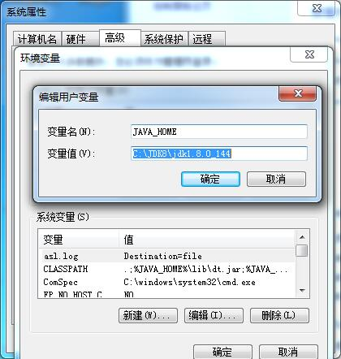
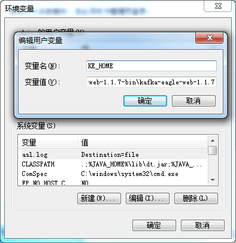

# Window Install

## 1.Install JDK
If there is a JDK environment on the Linux server, this step can be ignored, and the installation of the second section of the link. If there is no JDK, first to the Oracle official website to download JDK, [Download](http://www.oracle.com/technetwork/java/javase/downloads/index.html).

## 2.JAVA_HOME Configure
Run the downloaded ```*.exe``` file installation package directly, then configure environment variables:



## 3.Check JDK
Finally, we input ```java -version```, according to the following information:


## 4.KE_HOME Configure
Configure environment variables,As shown in the following figure:


## 5.Start Kafka Eagle
Go to the ```%KE_HOME%\bin``` directory and click the ```ke.bat``` file.
