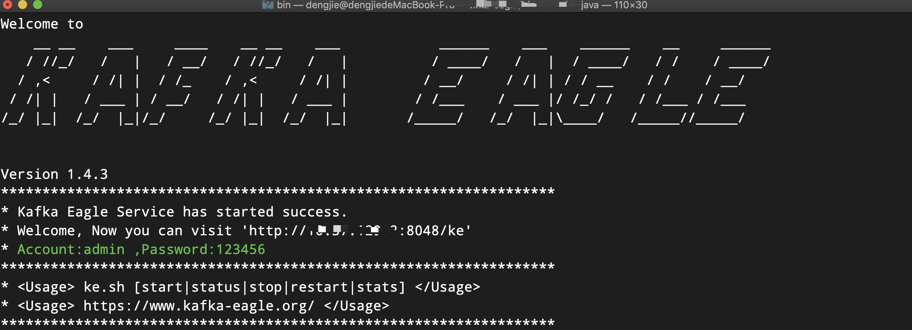

# 2.Install

## 1.Download Kafka Eagle

* [Download](http://download.smartloli.org/)
* [Github](https://github.com/smartloli/kafka-eagle)

## 2.Extract Kafka Eagle

Here we extract to `/data/soft/new` directory and extract, as shown below:

```bash
tar -zxvf kafka-eagle-${version}-bin.tar.gz
```

If you have installed the version before, delete the modified version, and rename the current version, as shown below:

```bash
rm -rf kafka-eagle
mv kafka-eagle-${version} kafka-eagle
```

## 3.Configure Kafka Eagle profile

```bash
vi /etc/profile

export KE_HOME=/data/soft/new/kafka-eagle
export PATH=$PATH:$KE_HOME/bin
```

Then, we use the `. /etc/profile` to enable the configuration to take effect immediately.

## 4.Configure Kafka Eagle system-config file

```bash
cd ${KE_HOME}/conf
vi system-config.properties

# Multi zookeeper&kafka cluster list -- The client connection address of the Zookeeper cluster is set here
kafka.eagle.zk.cluster.alias=cluster1,cluster2
cluster1.zk.list=tdn1:2181,tdn2:2181,tdn3:2181
cluster2.zk.list=xdn1:2181,xdn2:2181,xdn3:2181

# Kafka broker nodes online list
cluster1.kafka.eagle.broker.size=10
cluster2.kafka.eagle.broker.size=20

# Zkcli limit -- Zookeeper cluster allows the number of clients to connect to
kafka.zk.limit.size=25

# Kafka Eagle webui port -- WebConsole port access address
kafka.eagle.webui.port=8048

# Kafka offset storage -- Offset stored in a Kafka cluster, if stored in the zookeeper, you can not use this option
cluster1.kafka.eagle.offset.storage=kafka
cluster2.kafka.eagle.offset.storage=kafka

# Whether the Kafka performance monitoring diagram is enabled
kafka.eagle.metrics.charts=false

# Kafka Eagle keeps data for 30 days by default
kafka.eagle.metrics.retain=30

# If offset is out of range occurs, enable this property -- Only suitable for kafka sql
kafka.eagle.sql.fix.error=false
kafka.eagle.sql.topic.records.max=5000

# Delete kafka topic token -- Set to delete the topic token, so that administrators can have the right to delete
kafka.eagle.topic.token=keadmin

# Kafka sasl authenticate
cluster1.kafka.eagle.sasl.enable=false
cluster1.kafka.eagle.sasl.protocol=SASL_PLAINTEXT
cluster1.kafka.eagle.sasl.mechanism=SCRAM-SHA-256
cluster1.kafka.eagle.sasl.jaas.config=org.apache.kafka.common.security.scram.ScramLoginModule required username="admin" password="admin-secret";
# If not set, the value can be empty
cluster1.kafka.eagle.sasl.client.id=
# Add kafka cluster cgroups
cluster1.kafka.eagle.sasl.cgroup.enable=false
cluster1.kafka.eagle.sasl.cgroup.topics=kafka_ads01,kafka_ads02

cluster2.kafka.eagle.sasl.enable=true
cluster2.kafka.eagle.sasl.protocol=SASL_PLAINTEXT
cluster2.kafka.eagle.sasl.mechanism=PLAIN
cluster2.kafka.eagle.sasl.jaas.config=org.apache.kafka.common.security.plain.PlainLoginModule required username="admin" password="admin-secret";
cluster2.kafka.eagle.sasl.client.id=
cluster2.kafka.eagle.sasl.cgroup.enable=false
cluster2.kafka.eagle.sasl.cgroup.topics=kafka_ads03,kafka_ads04

# Default use sqlite to store data
kafka.eagle.driver=org.sqlite.JDBC
# It is important to note that the '/hadoop/kafka-eagle/db' path must exist.
kafka.eagle.url=jdbc:sqlite:/hadoop/kafka-eagle/db/ke.db
kafka.eagle.username=root
kafka.eagle.password=smartloli

# <Optional> set mysql address
#kafka.eagle.driver=com.mysql.jdbc.Driver
#kafka.eagle.url=jdbc:mysql://127.0.0.1:3306/ke?useUnicode=true&characterEncoding=UTF-8&zeroDateTimeBehavior=convertToNull
#kafka.eagle.username=root
#kafka.eagle.password=smartloli
```

## 5.Start Kafka Eagle

```bash
cd ${KE_HOME}/bin
chmod +x ke.sh
./ke.sh start
```

As shown in the following figure:



