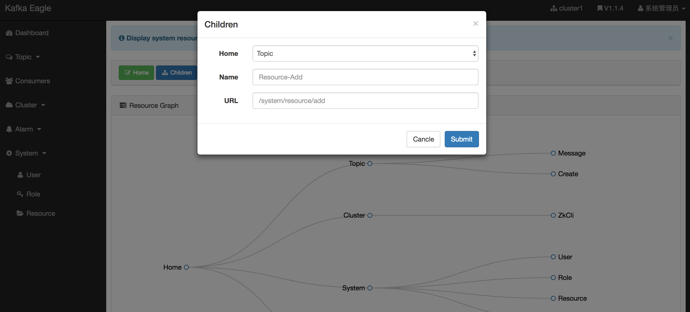
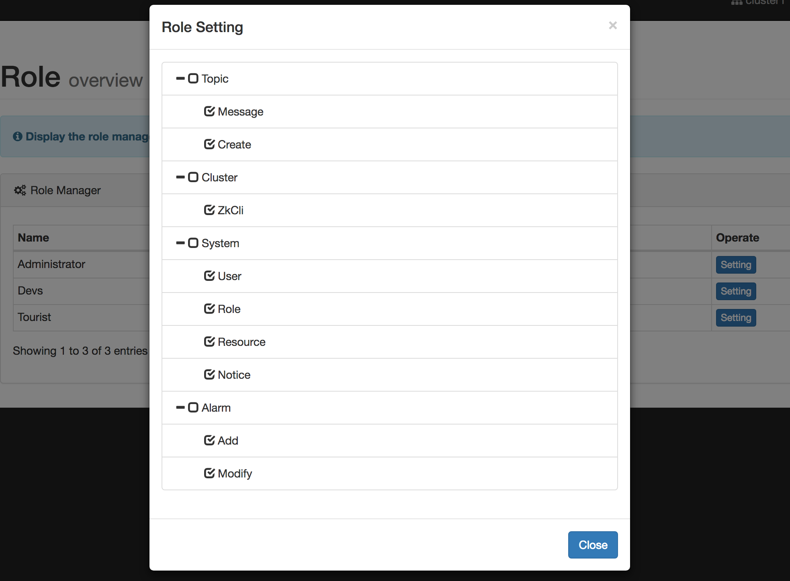
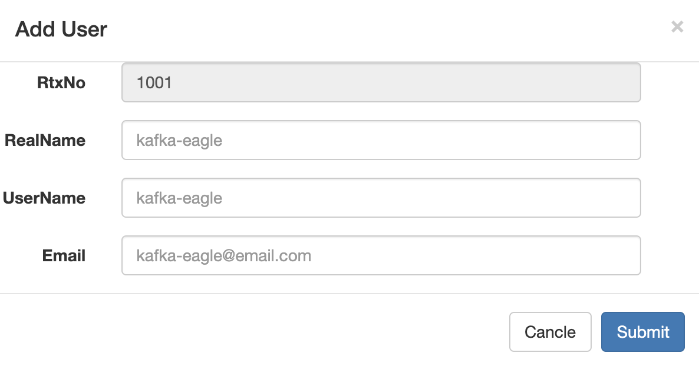
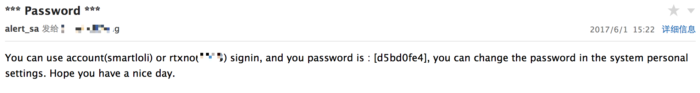

# System

## 1.Resource
Controls permissions for actions such as deletion, editing, etc., and the browsing operation is not controlled.

## 2.Role
Assign an accessible directory to each role.

## 3.User
Add users, fill in the corresponding user information, click Submit, and then fill in the mailbox will receive the corresponding login information (login name and password).

