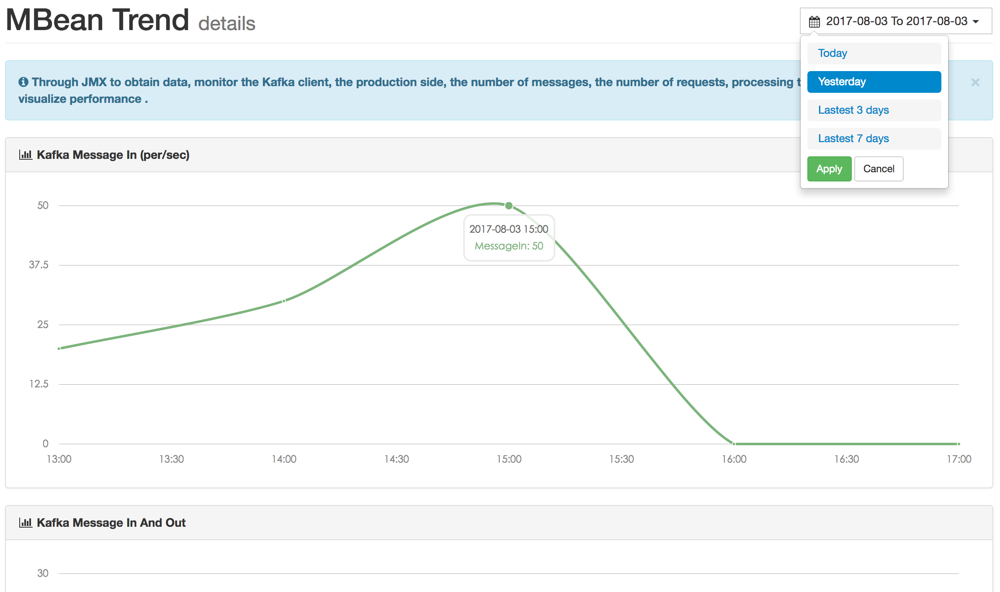

# Metrics

## MBean
Through JMX to obtain data, monitor the Kafka client, the production side, the number of messages, the number of requests, processing time and other data to visualize performance .

 

If your data is empty, check that the port of JMX is started . If you do not start, you can edit the script before you start .

```bash
vi kafka-server-start.sh
...
if [ "x$KAFKA_HEAP_OPTS" = "x" ]; then
    export KAFKA_HEAP_OPTS="-server -Xms2G -Xmx2G -XX:PermSize=128m -XX:+UseG1GC -XX:MaxGCPauseMillis=200 -XX:ParallelGCThreads=8 -XX:ConcGCThreads=5 -XX:InitiatingHeapOccupancyPercent=70"
    export JMX_PORT="9999"
    #export KAFKA_HEAP_OPTS="-Xmx1G -Xms1G"
fi
```

## Trend
Observe Kafka index data according to different dimensions.


