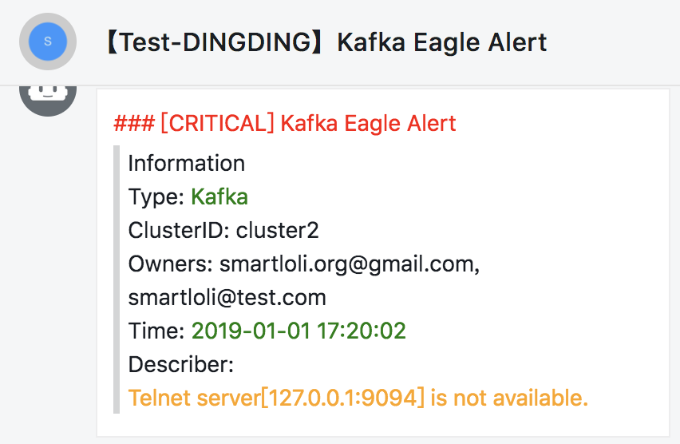
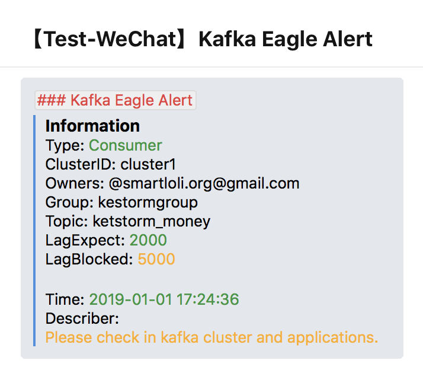
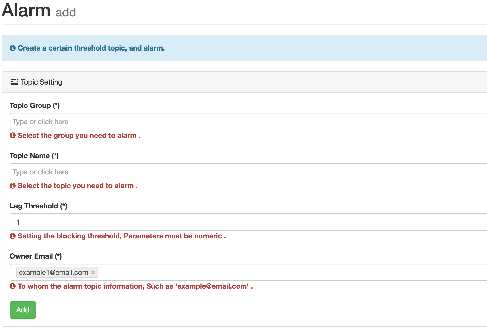

# Alarm

New alarm module, to pay attention to their own Topic alarm settings. No consumer information when Topic, more than the threshold, the alarm. At present, the alarm way through the message to the alarm, set as shown in the following figure:

## Support IM

In addition to supporting email alerts, Kafka Eagle also supports im alerts, such as DingDing and WeChat

### DingDing



### WeChat



## Configure Alarm



## List of Alarm


```bash
PS：Binary installation package, provides a SMTP test mail server, there is the existence of packet loss. In actual use, it is recommended to configure their own STMP mail server.
```


