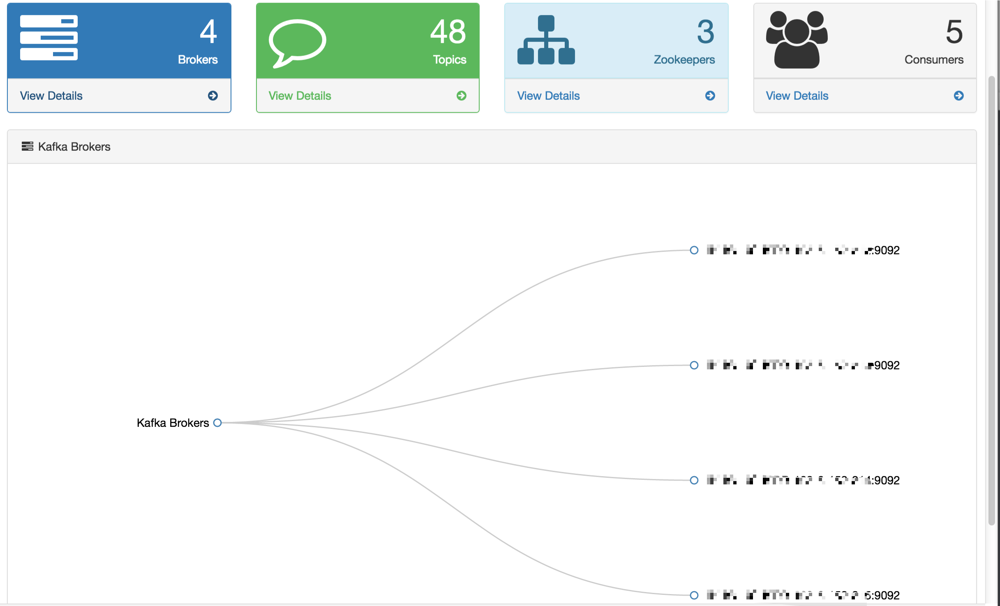

# 1.Dashboard

We enter `http://host:port/ke` through the browser, access to the Kafka Eagle Dashboard page. The page contains the following:

* Brokers
* Topics
* Zookeepers
* Consumers
* Kafka Brokers Graph

As shown in the following figure:

