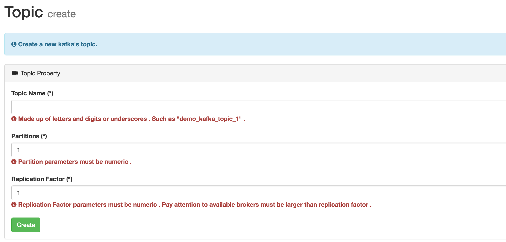
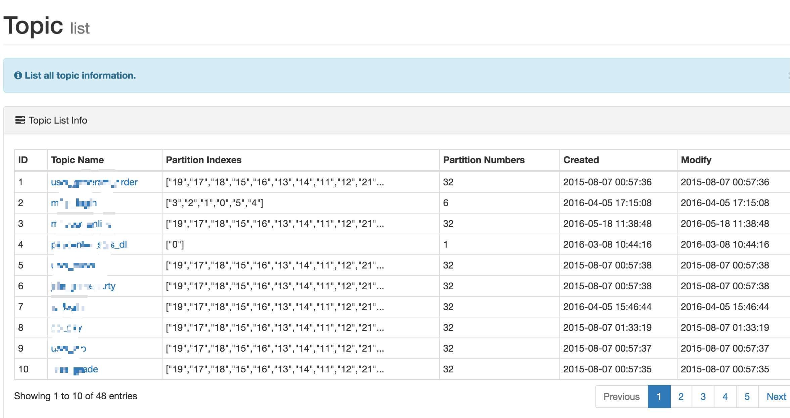
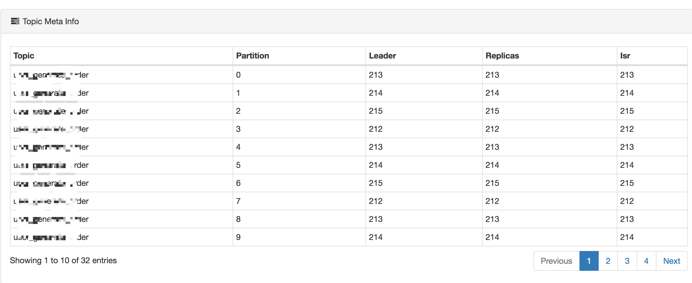
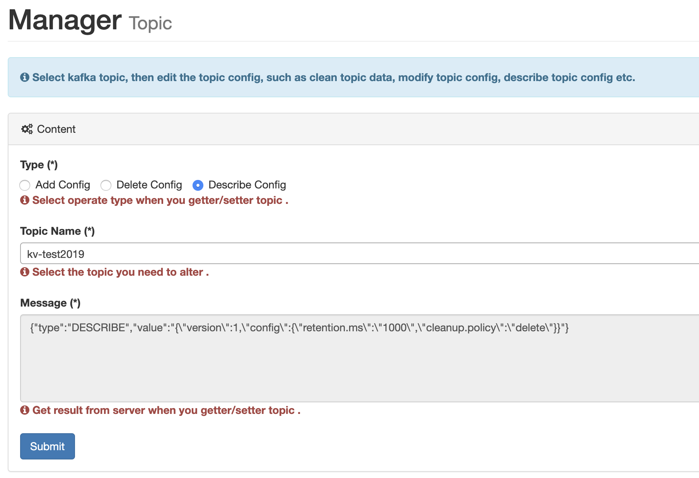

# 2.Topic

Topic columns under the current contains the creation and list, through the creation of a module can create a custom partition and the number of backup Topic. As shown in the following figure:

## 1.Create

## 2.List

The module follows all the Topic in the Kafka cluster, including the number of partitions, create time, and modify the Topic, as shown in the following figure:

### @Deprecated

### @Update

### 2.1 Topic Detail

Each Topic is corresponding to a hyperlink, you can view the details of the Topic, such as: `partition index number`, `Leader`, `Replicas` and `Isr`, as shown in the figure below:

## 3.Topic Config

Select kafka topic, then edit the topic config, such as clean topic data, modify topic config, describe topic config etc.

