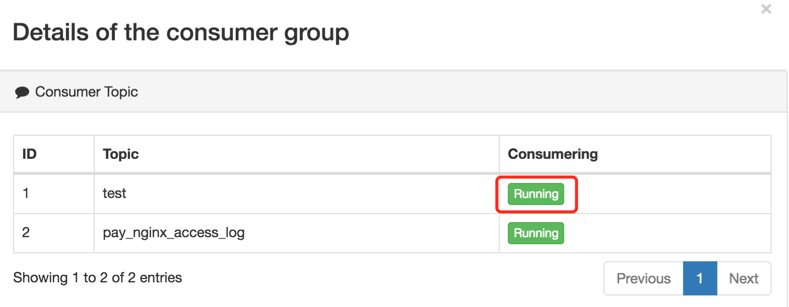
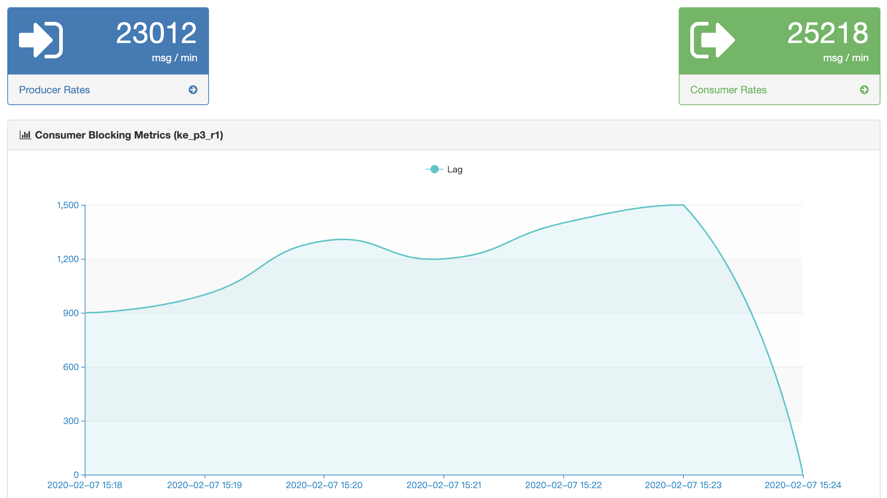

# 3.Consumer

The module shows the Topic information of consumer records, which contains the following contents:

* Running
* Pending
* Active Topic Graph

As shown in the following figure:

Each `Group` name of a is a hyperlink, show details of consumption, as shown below:

Click on the `Topic` name that is being consumed, showing the consumption and production rate diagram of the Topic, as shown below:

