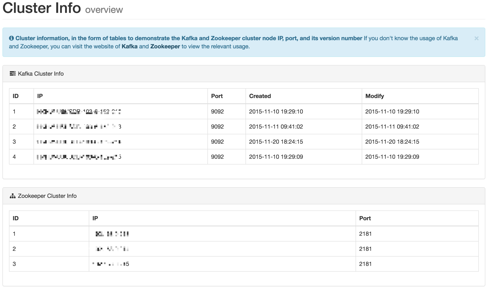

# 4.Cluster Info

This module displays Kafka cluster information and Zookeeper cluster information, including the following:

* Kafka Broker Host & IP
* Kafka Broker Created & Modify Date
* Zookeeper Host & IP

As shown in the following figure:

