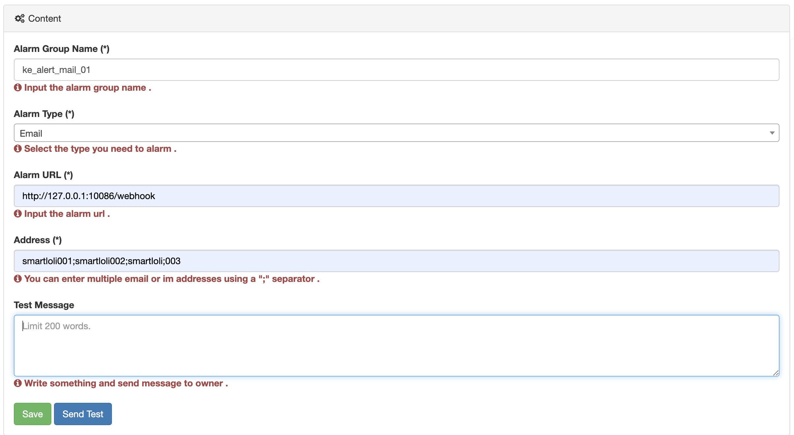
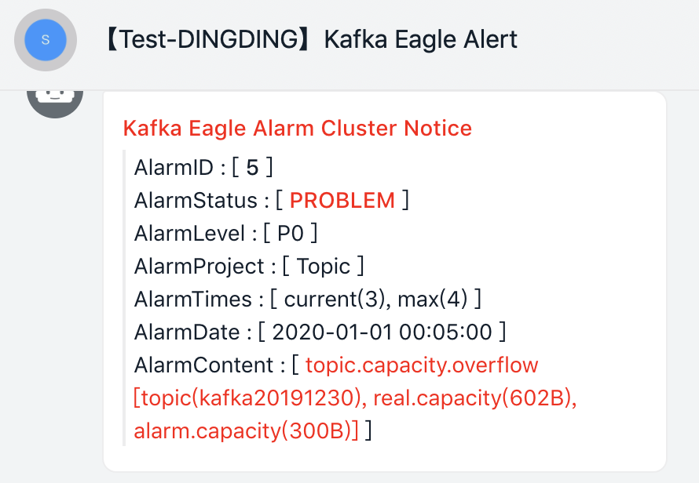

# 5.Alarm

New alarm module, to pay attention to their own Topic alarm settings. No consumer information when Topic, more than the threshold, the alarm. At present, the alarm way through the message to the alarm, set as shown in the following figure:

## Support IM

In addition to supporting `email` or `webhook` alerts, Kafka Eagle also supports im alerts, such as `DingDing` and `WeChat`

## Channel

First of all, it is necessary to configure alarm channels, select different alarm modes, and divide different alarm groups.



It should be noted that Kafka Eagle alarm mail uri:

```text
http://127.0.0.1:10086/email
```

Email or Webhook restful api server uri:

```text
http://127.0.0.1:10086/email?address="xxx@gmail.com"&msg="alarm msg"
```

Api server uri java code:

```java
@RestController
public class MailController {
    @RequestMapping(value="/email", method = RequestMethod.POST)
    public String sendPostMail(HttpServletRequest request) {
      // Send Alarm Message
        System.out.println("[PUT] address: " + request.getParameter("address") + ",msg: " + request.getParameter("msg"));
        return "OK";
    }
}
```

### DingDing



### WeChat


