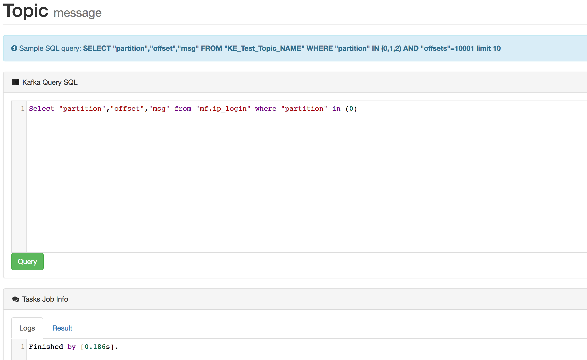
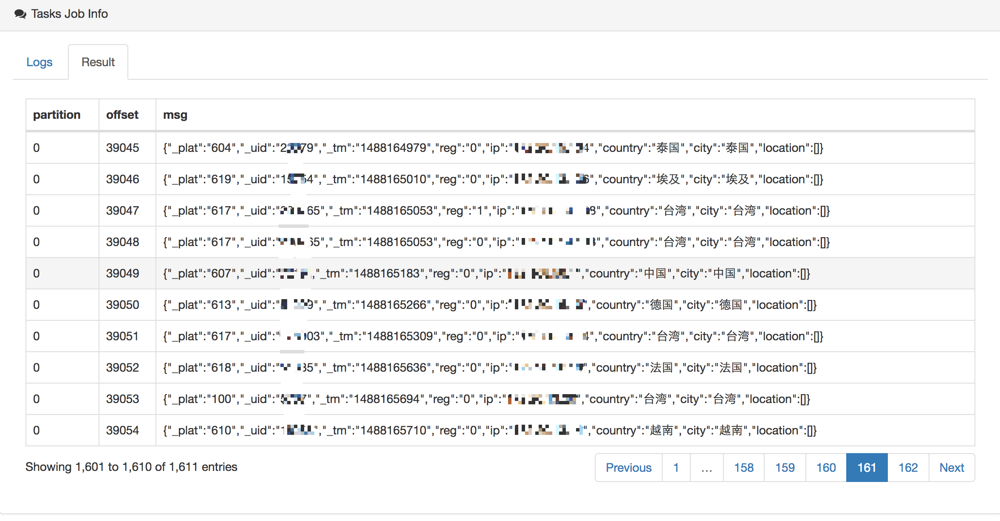

# 9.KafkaSQL

Use the SQL statement to the news data visualization in topic, for SQL queries, and table names field need to use double quotes to mark, example SQL is as follows:

```bash
select * from "ke_test_topic" where "partition" in (0,1,2) limit 100
```

As shown in the following figure:

## Edit SQL



## DataSets



```bash
Note: Access to topic message data, depending on the underlying interface record of the earliest and latest offset, the default display up to 5000 records.
```

## Parse JSONObject Or JSONArrays

Kafka topic datasets like this:

```text
[{"id":123,"name":"smartloli"},{"id":456,"name":"smartloli2"},{"id":789,"name":"smartloli3"}]
```

Then you can use sql query topic like this:

```text
select JSONS("msg",'name') from "topic_name" where "partition" in (0) limit 10
```

When Kafka topic datasets like this:

```text
{"id":123,"name":"smartloli001"}
{"id":456,"name":"smartloli002"}
```

Then you can use sql query topic like this:

```text
select JSON("msg",'name') from "topic_name" where "partition" in (0) limit 10
```

Add `and`:

```text
select JSON("msg",'name') from "topic_name" where "partition" in (0) and JSON("msg",'name') = 'smartloli001' limit 10
```

## Filter Query \[where ... and\]

Kafka topic datasets like this:

```text
kafka-eagle-01
kafka-eagle-02
kafka-eagle-02
kafka-eagle-03
kafka-eagle-03
...
kafka-eagle-03
kafka-eagle-04
```

Then you can use sql query topic like this:

```text
select * from "topic_name" where "partition" in (0) and "msg" = 'kafka-eagle-03' limit 10
```

Add `like`:

```text
select * from "topic_name" where "partition" in (0) and "msg" like 'kafka-eagle%' limit 10
```

Or:

```text
select * from "topic_name" where "partition" in (0) and "msg" like '%kafka-eagle%' limit 10
```

