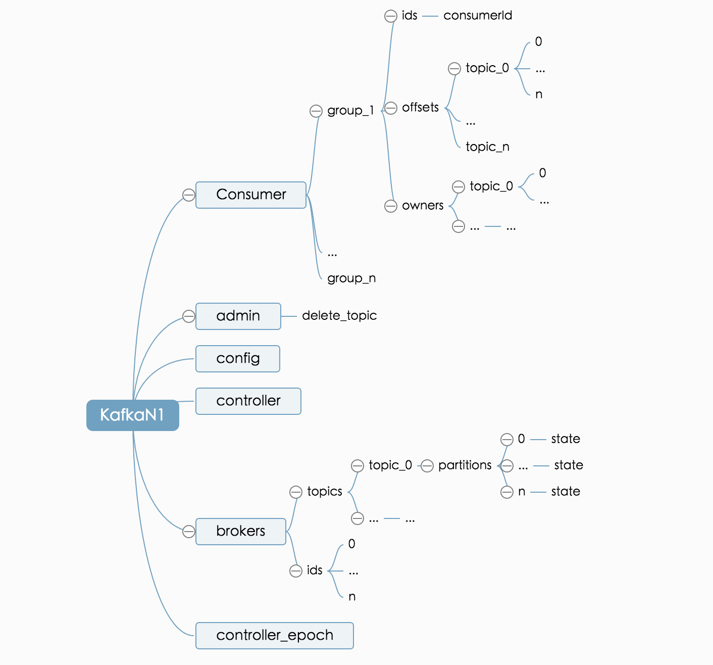

# 数据采集

Kafka Eagel 监控的消息数据源（兼容``` __consumer_offsets ```中的 ``` offset ```），来自于 Zookeeper。由于创建，修改或是消费 Kafka 的消息，都会在 Zookeeper 中进行注册，我们可以从中获取数据的变动，例如：Topic，Brokers，Partitions 以及 Group 等，Kafka 在 Zookeeper 的结构存储，如下图所示：

